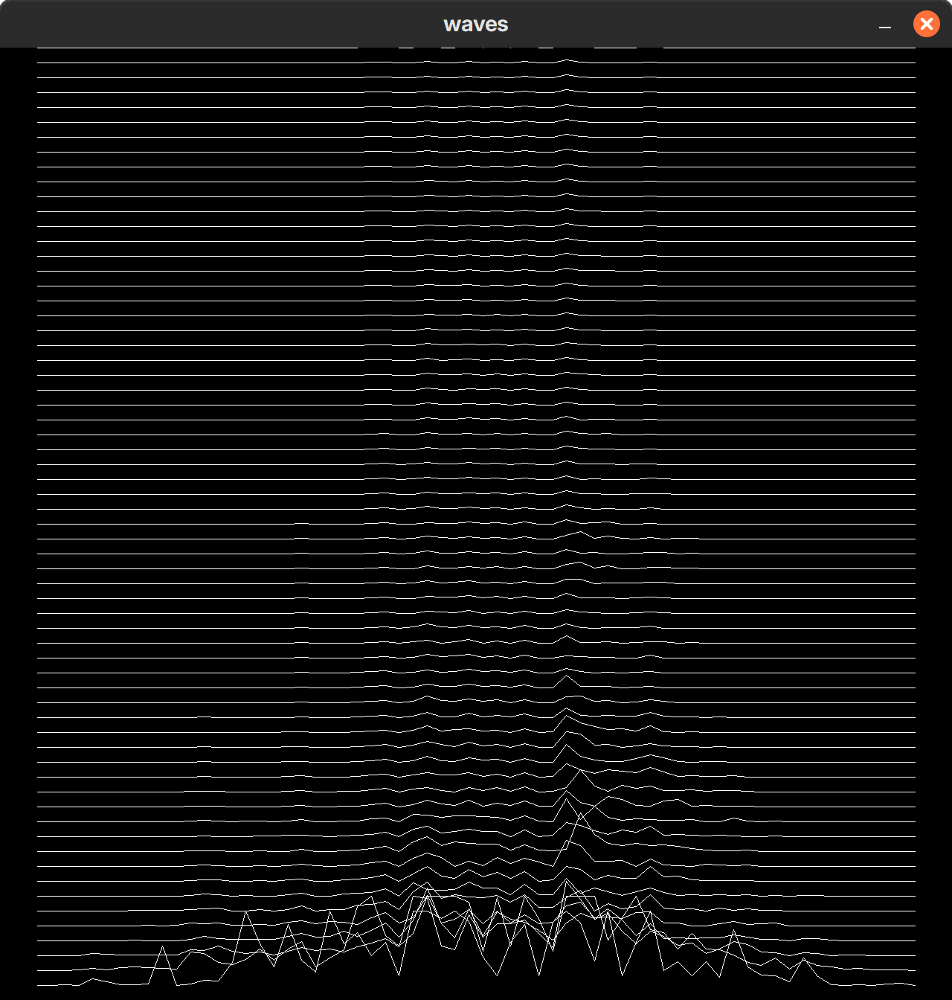

# waves

Reproducing Joy Division's Unknown Pleasures cover art in pure C by showing the moving real FFT of a wave file.



## Dependencies

* Allegro 4.4
* KissFFT (compiled with `float` support)
* libsndfile

## Building

```bash
mkdir build
cd build
cmake ..
make
```

## Usage

```bash
cd build
./waves <path/to/file.wav>
```
